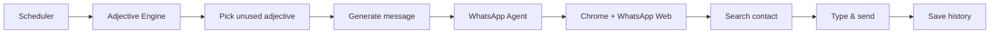

# WhatsApp Identity Agent

[](https://www.python.org/)
[](https://www.selenium.dev/)
[](LICENSE)

An intelligent Python automation bot that sends **one unique adjective-based message every day** to a WhatsApp contact or group — describing how you look, your vibe, or personality with fresh wording each time.

```
[09:00:01] INFO  Identity Agent started
[09:00:05] OK    WhatsApp Session Restored
[09:00:08] INFO  Generating identity message...
[09:00:10] OK    Message Sent Successfully
```

---

## Features

| Feature | Description |
|---------|-------------|
| **Daily automation** | Sends at a fixed time using `schedule` |
| **1,700+ adjectives** | Massive categorized dataset in `data/adjectives.json` |
| **Non-repetition** | Tracks used words; resets pool when exhausted |
| **One-word messages** | Sends a single adjective only (e.g. `fantastic`) |
| **One word daily** | Sends only `fantastic`, `great`, `amazing`, … (see `data/how_are_you_answers.json`) |
| **Sequential daily list** | Sends answers A–Z, one per day, no repeat until list finishes |
| **Session persistence** | Chrome profile saves WhatsApp Web login |
| **Retry logic** | Handles slow connections with configurable retries |
| **Premium logging** | Colorful terminal output + `logs/app.log` |
| **Error screenshots** | Auto-capture on failures for debugging |

---

## Project Structure

```
identity_agent/
├── main.py                 # Entry point & CLI
├── config.py               # Environment configuration
├── adjective_engine.py     # Adjective + message generation
├── whatsapp_agent.py       # Selenium WhatsApp Web automation
├── scheduler.py            # Daily scheduling
├── logger_config.py        # Premium terminal logging
├── utils.py                # JSON I/O helpers
├── requirements.txt
├── README.md
├── .env.example
├── .gitignore
├── data/
│   ├── adjectives.json     # 1000+ adjective dataset
│   ├── used_adjectives.json
│   └── message_history.json
├── logs/
├── chrome_profile/         # Persistent WhatsApp session
├── screenshots/
└── errors/
```

---

## Prerequisites

- **Windows 10/11** (or Linux/macOS with Chrome)
- **Python 3.10+**
- **Google Chrome** (latest)
- **WhatsApp** account on your phone (for QR login on first run)
- Stable internet connection

---

## Installation

### 1. Clone or download the project

```bash
cd identity_agent
```

### 2. Create a virtual environment (recommended)

**Windows (PowerShell):**

```powershell
python -m venv venv
.\venv\Scripts\Activate.ps1
```

**Windows (CMD):**

```cmd
python -m venv venv
venv\Scripts\activate.bat
```

**macOS/Linux:**

```bash
python3 -m venv venv
source venv/bin/activate
```

### 3. Install dependencies

```bash
pip install -r requirements.txt
```

### 4. Configure environment

```bash
copy .env.example .env
```

Edit `.env` and set your target contact:

```env
TARGET_CONTACT_NAME=Best Friend
SEND_TIME=09:00
HEADLESS=False
```

> **Important:** `TARGET_CONTACT_NAME` must match the name exactly as it appears in WhatsApp search.

---

## VS Code Setup

1. Open the `identity_agent` folder in VS Code.
2. Install the **Python** extension (Microsoft).
3. Press `Ctrl+Shift+P` → **Python: Select Interpreter** → choose `venv`.
4. Optional: create `.vscode/launch.json`:

```json
{
  "version": "0.2.0",
  "configurations": [
    {
      "name": "Identity Agent (now)",
      "type": "debugpy",
      "request": "launch",
      "program": "${workspaceFolder}/main.py",
      "args": ["--now"],
      "console": "integratedTerminal"
    },
    {
      "name": "Identity Agent (scheduler)",
      "type": "debugpy",
      "request": "launch",
      "program": "${workspaceFolder}/main.py",
      "console": "integratedTerminal"
    }
  ]
}
```

---

## Running the Agent

### First run — link WhatsApp

```bash
python main.py --now
```

1. Chrome opens WhatsApp Web.
2. Scan the QR code with your phone (Settings → Linked Devices).
3. The session is saved in `chrome_profile/` — you only scan once.
4. The bot searches your contact and sends the first message.

### Daily scheduled mode

```bash
python main.py
```

The agent waits until `SEND_TIME` (e.g. `09:00`) each day, then sends automatically. Keep the terminal open or run as a background service.

### View the full word list and progress

```bash
python main.py --list
```

Shows every adjective, which were already sent `[x]`, and which word is **NEXT**.

### Send immediately (test)

```bash
python main.py --now
```

### Scheduler only (no immediate send)

```bash
python main.py --schedule-only
```

---

## Screenshots

Place your own screenshots here after running:

| Screenshot | Description |
|------------|-------------|
| `screenshots/login.png` | WhatsApp Web QR / login |
| `screenshots/message_sent.png` | Message in chat |
| `screenshots/terminal.png` | Premium terminal logs |

Error screenshots are saved automatically to `screenshots/` and `errors/`.

---

## How It Works



1. **Adjective Engine** loads the word list from `data/adjectives.json`, sends the **next word in order** each day (Day 1 → first word, Day 2 → second, …), then resets when the list finishes.
2. **WhatsApp Agent** opens Chrome with a persistent profile, restores session, searches the target, types with human-like delay, and sends.
3. **Scheduler** triggers the job daily at `SEND_TIME`.

---

## Environment Variables

| Variable | Default | Description |
|----------|---------|-------------|
| `TARGET_CONTACT_NAME` | *(required)* | Contact or group name |
| `SEND_TIME` | `09:00` | Daily send time (24h) |
| `HEADLESS` | `False` | Hide Chrome window |
| `CHROME_PROFILE_PATH` | `./chrome_profile` | Session storage |
| `WAIT_TIMEOUT` | `30` | Selenium wait (seconds) |
| `RETRY_ATTEMPTS` | `3` | Retries per action |
| `TYPE_DELAY_MIN` | `0.05` | Min typing delay (s) |
| `TYPE_DELAY_MAX` | `0.15` | Max typing delay (s) |

---

## Troubleshooting

### Python not found

Use the full path or add Python to PATH:

```powershell
C:\Users\admin\AppData\Local\Programs\Python\Python313\python.exe main.py --now
```

### QR code / login timeout

- Increase `WAIT_TIMEOUT=60` in `.env`.
- Run with `HEADLESS=False` so you can scan the QR code.
- Delete `chrome_profile/` and log in again if session is corrupted.

### Contact not found / Search box not found

- Use the **exact** display name from WhatsApp.
- **Pin Sahil's chat** at the top of your chat list — the bot opens contacts from recent chats first (no search needed).
- Send Sahil one message manually so the chat appears in recents.
- For groups, use the full group name.
- Increase `WAIT_TIMEOUT=90` in `.env` on slow PCs.

### ChromeDriver issues

`webdriver-manager` downloads the matching driver automatically. Update Chrome to the latest version.

### Message not sending

- Check `screenshots/` and `logs/app.log`.
- WhatsApp Web UI changes — selectors may need updates in `whatsapp_agent.py`.

### Rebuild adjective dataset

```bash
python scripts/build_adjectives.py
```

---

## Future Improvements

- [ ] Telegram / Discord support
- [ ] Multi-contact scheduling
- [ ] Web dashboard for message history
- [ ] AI-generated adjectives via LLM API
- [ ] Docker container + systemd/Windows Task Scheduler
- [ ] Image/sticker messages
- [ ] Timezone-aware scheduling

---

## Tech Stack

- **Python 3.10+**
- **Selenium 4** + **webdriver-manager**
- **python-dotenv** — configuration
- **schedule** — daily jobs
- **colorama** — premium terminal UI

---

## Disclaimer

This project automates WhatsApp Web for personal/educational use. Respect WhatsApp's Terms of Service and the recipient's preferences. Use responsibly.

---

## Author

Built as a resume-worthy AI automation project — modular, production-style Python with real browser automation.

**Star this repo if it helped you.**
